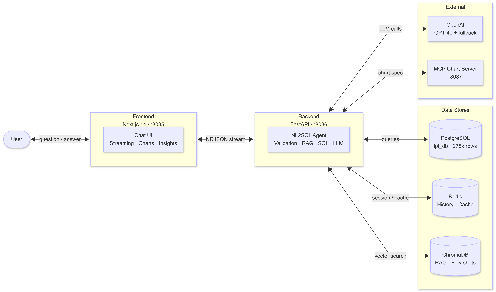

# IPL Cricket Analyst

Ask IPL cricket questions in plain English and get back SQL, answers, insights, and charts.

This project is an NL2SQL analytics agent for IPL data. It translates natural-language questions into SQL, executes them safely against a PostgreSQL database, and streams back results with analyst-style explanations and optional visualizations.

**Highlights**
- **98% accuracy** on a 50-question ground-truth evaluation
- **278k+ ball-by-ball deliveries**
- **9 PostgreSQL tables**
- Supports **follow-up questions**, **streaming responses**, and **on-demand charts**

```bash
docker compose up --build
```

---


---

## Overview

IPL Cricket Analyst is built for querying IPL data conversationally.

Instead of writing SQL manually, users can ask questions such as:

- *"Who scored the most runs in 2023?"*
- *"What was his strike rate?"*
- *"Show that as a chart."*

The agent keeps track of conversation context, generates SQL, validates it, executes it, and returns:

- the generated SQL
- a natural-language answer
- follow-up insights
- a chart when requested

It is designed to be fast, safe, and accurate for cricket-specific analytics.

---

## Key features

**Natural-language IPL analytics**
Ask questions in plain English without knowing SQL or the schema.

**Multi-turn follow-ups**
The agent resolves references like "his", "that season", or "show that as a chart" using conversation history.

**Streaming responses**
SQL appears first, then the answer, then insights and charts as they are generated.

**Cricket-aware correctness**
The system applies IPL-specific rules for batting, bowling, innings aggregation, and fielding statistics.

**On-demand chart generation**
Users can request visualizations and receive rendered Vega-Lite charts inline.

**Production-oriented safeguards**
Includes input validation, SELECT-only SQL enforcement, semantic SQL validation, rate limiting, circuit breaking, and optional API key authentication.

---

## How it works

Each user question flows through the agent pipeline inside `run_agent_stream()`:

```
Input validation
→ Response cache
→ Query rewrite + history summarization
→ Entity resolution
→ [Table selection ∥ Cricket RAG]
→ SQL generation (27 few-shot examples, k=3 dynamic selection)
→ SQL validation + semantic check
→ SQL execution (auto-fix retry ×2)
→ [Answer rephrase ∥ Insights generation ∥ Viz agent]  ← parallel
→ Streamed NDJSON back to frontend
```

### Why it stays accurate

The agent is grounded with:

- a 1300-line cricket rules specification
- 27 IPL-specific few-shot SQL examples
- retrieval over schema and cricket logic
- semantic SQL validation before execution

This helps it produce correct answers for cricket-specific questions such as strike rate, economy, innings-level totals, and fielding stats.

### Conversation memory

Conversation history is stored per `thread_id` in Redis and also persisted in `localStorage`, so sessions survive page refreshes.

---

## Architecture



| Layer | Technology |
|-------|-----------|
| Frontend | Next.js 14 · TypeScript · Tailwind CSS |
| Backend | FastAPI · Python 3.11 · LangChain |
| Database | PostgreSQL (`ipl_db`) — 9 tables, 278k+ rows |
| Vector store | ChromaDB — disk-persistent, embedding-versioned |
| Cache / History | Redis 7 — conversation history (24h TTL) + response cache (1h TTL) |
| LLM | GPT-4o (SQL) · GPT-4o-mini (rewrite, insights, rephrase) |
| Charts | MCP Chart Server — deterministic Vega-Lite v5 specs |

**Dataset**: [IPL Cricket Dataset (2008–2025) — PostgreSQL](https://www.kaggle.com/datasets/sandeepbkadam/ipl-cricket-dataset-20082025-postgresql)

---

## Project structure

```
frontend/      — Next.js UI for chat, streaming, and chart rendering
backend/       — FastAPI app, agent pipeline, prompts, validation, and SQL execution
scripts/       — evaluation scripts and test cases
```

Redis, ChromaDB, and PostgreSQL run as supporting services via Docker Compose.

---

## Quick start

### Prerequisites

| Tool | Version |
|------|---------|
| Docker | 24+ |
| Docker Compose | v2 |
| Node.js (local dev only) | 20+ |
| Python (local dev only) | 3.11+ |

### 1. Clone the repository

```bash
git clone <your-repo-url> nl2sql_agent
cd nl2sql_agent
cp .env.example .env
```

### 2. Configure environment variables

Edit `.env`:

```env
OPENAI_API_KEY=sk-...
DB_USER=postgres
DB_PASSWORD=yourpassword
DB_HOST=host.docker.internal
DB_PORT=5432
DB_NAME=ipl_db
```

### 3. Create the database

```bash
psql -U postgres -c "CREATE DATABASE ipl_db;"
```

Then import the IPL dataset into `ipl_db` using the dataset linked above.

### 4. Start the stack

```bash
docker compose up --build
```

### 5. Open the app

| Service | URL |
|---------|-----|
| Frontend | http://localhost:8085 |
| Backend | http://localhost:8086 |
| Swagger docs | http://localhost:8086/docs |
| Health check | http://localhost:8086/health |

```bash
docker compose down   # stop everything
```

---

## Local development

### Backend

```bash
cd backend
python -m venv .venv
source .venv/bin/activate        # Windows: .venv\Scripts\activate
pip install -r requirements.txt
uvicorn app.main:app --reload --port 8086
```

### Frontend

```bash
cd frontend
npm install
cp .env.local.example .env.local
npm run dev
```

---

## Using the API

### `GET /health`

Returns:

```json
{"status": "ok"}
```

---

### `POST /api/query`

Returns a full response after processing completes.

**Request**

```json
{
  "question": "Who scored the most runs in IPL 2016?",
  "thread_id": "550e8400-e29b-41d4-a716-446655440000"
}
```

`thread_id` must be a valid UUID v4. The frontend generates and persists one automatically.

**Response**

```json
{
  "answer": "Virat Kohli scored the most runs in IPL 2016 with 973 runs.",
  "sql": "SELECT batsman, SUM(batsman_runs) AS total_runs ...",
  "insights": {
    "key_takeaway": "Virat Kohli dominated IPL 2016 with 973 runs.",
    "follow_up_chips": [
      "How many hundreds did he score?",
      "Who was second?",
      "What was his strike rate?"
    ]
  },
  "chart_spec": null
}
```

---

### `POST /api/query/stream`

Returns `application/x-ndjson` and streams pipeline milestones as they complete.

**Event types**

| Event | Payload |
|-------|---------|
| `sql_ready` | `{"type": "sql_ready", "sql": "..."}` |
| `answer_ready` | `{"type": "answer_ready", "answer": "..."}` |
| `insights_ready` | `{"type": "insights_ready", "insights": {...}}` |
| `chart_ready` | `{"type": "chart_ready", "chart_spec": {...}}` |
| `error` | `{"type": "error", "error": "..."}` |

The frontend uses this endpoint exclusively so users can see SQL immediately while the rest of the response is still being generated.

---

### Error handling

All error responses use `{"detail": "..."}`.

| Status | Cause |
|--------|-------|
| 400 | Input validation failed (too long, injection detected, SQL keywords in question) |
| 401 | `X-API-Key` header missing |
| 403 | `X-API-Key` incorrect |
| 422 | `thread_id` is not a valid UUID v4 |
| 429 | Per-IP rate limit exceeded (20 req/min) or OpenAI rate limit hit |
| 503 | Circuit breaker open after repeated LLM failures |
| 504 | Request timed out after 60s |

---

## Authentication

Authentication is disabled by default for local development.

To enable API key auth, generate a key:

```bash
python -c "import secrets; print(secrets.token_hex(32))"
```

Then add it to `.env`:

```env
API_KEY=<generated-key>
NEXT_PUBLIC_API_KEY=<same-key>
```

Rebuild the app:

```bash
docker compose up --build
```

> `NEXT_PUBLIC_API_KEY` is exposed in the browser bundle, which is acceptable for single-tenant/local use.
> For real multi-user access control, replace this with JWT-based authentication.

---

## Testing

### Backend unit tests

```bash
cd backend
pip install -r requirements.txt
pytest tests/unit -v
```

443 unit tests covering: rewrite guards, response cache, circuit breaker, input validation,
SQL helpers, visualization helpers, insights, embedding versioning, history summarization,
UUID v4 validation.

### Backend integration tests

```powershell
.\run_tests.ps1
```

### Frontend unit tests

```bash
cd frontend
npm test
```

27 Jest tests covering: localStorage persistence, session management, streaming event
handling, error states, initial render.

---

## Evaluation

A 50-question ground-truth evaluation suite is available in `scripts/eval_testcases.json`.

```bash
cd scripts
python eval.py
```

Results are written to `scripts/eval_report.md`. Latest result: **98% accuracy (49/50 PASS)**.

To improve accuracy: update or add examples in `backend/app/prompts.py`, restart the backend
to rebuild ChromaDB, then re-run the evaluation.

---

## Extending the project

**Add few-shot examples** — add entries to `IPL_EXAMPLES` in `backend/app/prompts.py`.
Each needs `"input"` (question) and `"query"` (correct SQL). The selector dynamically
chooses the most relevant k=3 examples at runtime.

**Add tables** — add a row to `backend/app/database_table_descriptions.csv`. The table
selector and SQL generator will automatically pick up the new schema description.

**Change the embedding model** — set `OPENAI_EMBEDDING_MODEL` in `.env`. Both ChromaDB
collections are embedding-versioned and rebuild automatically on the next startup.

**Adjust input validation** — edit `_MAX_QUESTION_LENGTH`, `_INJECTION_PATTERNS`, or
`_DANGEROUS_SQL_IN_INPUT` in `backend/app/input_validator.py`.

---

## Deployment notes

- Set `--reload` to `False` in the backend Docker `CMD`
- Configure `ALLOWED_ORIGINS` and `NEXT_PUBLIC_BACKEND_URL` for your real domain
- Place a reverse proxy such as nginx or Caddy in front of the services
- Replace single-key auth with proper user authentication if needed

---

## Why this project is useful

This project is a practical example of a domain-aware NL2SQL system that goes beyond generic text-to-SQL demos.

It combines domain grounding, retrieval-augmented generation, semantic SQL safeguards,
streaming UX, conversational memory, and chart generation — making it useful both as a
real IPL analytics assistant and as a reference architecture for production-style NL2SQL agents.
