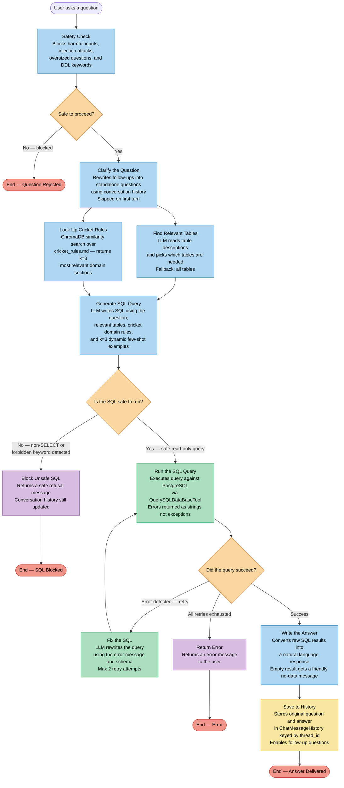

# NL2SQL Agent — Multi Agent Chatbot Flow

---

## What Each Agent Does

| Agent | What it does |
|---|---|
| **Safety Check** | Blocks harmful inputs, injection attacks, oversized questions, and DDL keywords |
| **Clarify the Question** | Rewrites vague follow-ups like "What about 2020?" into complete standalone questions |
| **Find Relevant Tables** | LLM picks which database tables are needed to answer the question |
| **Look Up Cricket Rules** | Searches cricket_rules.md via ChromaDB for domain-specific rules (e.g. batting average formula) |
| **Generate SQL Query** | LLM writes SQL using the question, relevant tables, cricket rules, and similar past examples |
| **Run the SQL Query** | Executes the generated query against the IPL PostgreSQL database |
| **Fix the SQL** | If the query fails, LLM reads the error message and rewrites the query to fix the mistake |
| **Block Unsafe SQL** | If the generated SQL contains forbidden keywords, returns a safe refusal instead of executing |
| **Return Error** | If all retry attempts fail, returns an error message to the user |
| **Write the Answer** | Converts raw database results into a natural language response |
| **Save to History** | Persists the question and answer so follow-up questions work correctly |

## Parallel Execution

**Find Relevant Tables** and **Look Up Cricket Rules** run simultaneously via `asyncio.gather`.
The cricket knowledge retrieval runs in the background while the table-selection LLM call is in flight — net wall-clock cost: zero.

## Decision Points

| Decision | Outcomes |
|---|---|
| **Safe to proceed?** | Blocked (HTTP 400) if the question contains injection patterns or DDL keywords. Otherwise continues. |
| **Is the SQL safe to run?** | Blocked (HTTP 200 + safe answer) if SQL is non-SELECT or contains forbidden keywords. Continues if valid read-only. |
| **Did the query succeed?** | Error detected: LLM fixes and re-runs, up to 2 attempts. All retries exhausted: error message. Success: answer is generated. |
