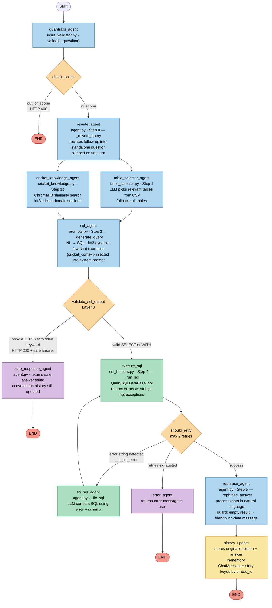

# NL2SQL Agent — Multi Agent Chatbot Flow



---

## Agent Responsibilities

| Agent | File | Role |
|---|---|---|
| `guardrails_agent` | `input_validator.py` | Blocks injections, DDL keywords, oversized input |
| `rewrite_agent` | `agent.py` | Rewrites follow-ups into standalone questions |
| `table_selector_agent` | `table_selector.py` | Picks relevant tables from CSV descriptions |
| `cricket_knowledge_agent` | `cricket_knowledge.py` | RAG retrieval of cricket domain rules (ChromaDB) |
| `sql_agent` | `prompts.py` + `agent.py` | NL → SQL with few-shot examples + domain context |
| `execute_sql` | `sql_helpers.py` | Runs SQL against PostgreSQL via LangChain tool |
| `fix_sql_agent` | `agent.py` | LLM corrects SQL using DB error message + schema |
| `safe_response_agent` | `agent.py` | Returns safe answer when SQL is blocked (Layer 3) |
| `error_agent` | `agent.py` | Returns final error when retries exhausted |
| `rephrase_agent` | `agent.py` | Converts raw SQL result to natural language answer |
| `history_update` | `agent.py` | Persists turn to in-memory `ChatMessageHistory` |

## Parallel Execution

`table_selector_agent` and `cricket_knowledge_agent` run **simultaneously** via `asyncio.gather`.
This hides the embedding API call latency behind the table-selection LLM call — net wall-clock cost: zero.

## Decision Points

| Decision | Outcomes |
|---|---|
| `check_scope` | `out_of_scope` (HTTP 400) · `in_scope` |
| `validate_sql_output` | `blocked` (HTTP 200 + safe answer) · `valid` |
| `should_retry` | `error` → `fix_sql_agent` → `execute_sql` loop (max 2) · `exhausted` → `error_agent` · `success` → `rephrase_agent` |
```
