# NL2SQL Agent — Architecture Drawing Blueprint

Use this as a reference to draw the architecture in draw.io, Lucidchart, or similar.

---

## Canvas Layout (left to right, 5 columns)

```
┌──────────┐   ┌──────────────┐   ┌────────────────────────────────────────┐   ┌──────────────────────┐   ┌────────────┐
│  COLUMN 1 │   │   COLUMN 2   │   │              COLUMN 3                  │   │       COLUMN 4       │   │  COLUMN 5  │
│   User    │   │  Frontend    │   │            Backend / Agents            │   │   Knowledge Stores   │   │  Database  │
└──────────┘   └──────────────┘   └────────────────────────────────────────┘   └──────────────────────┘   └────────────┘
```

---

## Boxes to Draw

### Column 1 — User
- **Box:** User (person icon or simple rectangle)
- Label: `User`

---

### Column 2 — Frontend
- **Box:** Next.js App (rectangle)
  - Label: `Next.js 14`
  - Sub-label: `port 8085`
  - Contents note: `Chat UI · thread_id session`

---

### Column 3 — Backend (draw as a large container/swimlane)

Title bar: `FastAPI Backend · port 8086`

Inside, stack these boxes top to bottom:

| # | Box Name | Label | Notes |
|---|---|---|---|
| 1 | Rate Limiter | `SlowAPI Middleware` | limiter.py — 20 req/min per IP, Redis-backed |
| 2 | API Entry | `POST /api/query` | routes/query.py — 60s timeout, 429/503/504 handling |
| 3 | Guardrail Agent | `Guardrail Agent` | input_validator.py |
| 4 | Rewrite Agent | `Rewrite Agent` | Step 0 — query rewrite |
| 5 | Entity Resolver | `Entity Resolver` | entity_resolver.py — full name → canonical name |
| 6a | Table Selector Agent | `Table Selector Agent` | parallel — left branch |
| 6b | Cricket Knowledge Agent | `Cricket Knowledge Agent` | parallel — right branch |
| 7 | SQL Agent | `SQL Agent` | prompts.py — NL → SQL |
| 8 | Execute SQL | `Execute SQL` | sql_helpers.py |
| 9 | Fix SQL Agent | `Fix SQL Agent` | retry loop — connects back to 8 |
| 10a | Analysis Agent | `Analysis Agent` | Step 5a — rephrase_answer |
| 10b | Insights Agent | `Insights Agent` | Step 5b — key_takeaway + chips (Phase 8) |
| 10c | Viz Agent | `Viz Agent` | Step 5c — chart spec via MCP (Phase 9) |

Draw boxes 6a and 6b side-by-side (they run in parallel).
Draw boxes 10a, 10b, and 10c side-by-side (they run in parallel).
Draw box 9 to the side of box 8 with a looping arrow.

---

### Column 4 — Knowledge Stores (two separate boxes)

| Box | Label | Notes |
|---|---|---|
| ChromaDB — Few-shot | `ChromaDB` / `Few-Shot Examples` | 17 IPL examples, k=3 similarity; persistent to `/app/chroma_data/few_shot`; SHA-256 hash invalidation |
| ChromaDB — Cricket Rules | `ChromaDB` / `Cricket Rules` | cricket_rules.md, k=3 similarity; persistent to `/app/chroma_data/cricket_rules`; SHA-256 hash invalidation |

---

### Column 5 — External Services (stack vertically)

| Box | Label | Notes |
|---|---|---|
| PostgreSQL | `PostgreSQL` / `ipl_db` | cylinder/database icon, 9 tables |
| Redis | `Redis 7 Alpine` | session history + chips (TTL 24h) + rate limit counters + response cache |
| Schema Watcher | `schema_watcher.py` | (Phase 14, planned) startup check — hashes `information_schema.columns`; logs WARNING on drift |
| MCP Chart Server | `MCP Chart Server` / `port 8087` | deterministic Vega-Lite spec generation |
| LLM Primary | `GPT-4o` | primary LLM |
| LLM Fallbacks | `Claude / Gemini 2.0 Flash / DeepSeek / Ollama` | fallback chain |

---

## Arrows to Draw

### Main request flow (left to right)

| From | To | Label |
|---|---|---|
| User | Next.js App | question |
| Next.js App | POST /api/query | HTTP POST + thread_id |
| POST /api/query | Guardrail Agent | raw question |
| Guardrail Agent | Rewrite Agent | validated question |
| Rewrite Agent | Table Selector Agent | standalone question |
| Rewrite Agent | Cricket Knowledge Agent | standalone question |
| Table Selector Agent | SQL Agent | table names |
| Cricket Knowledge Agent | SQL Agent | cricket context |
| SQL Agent | Execute SQL | SQL query |
| Execute SQL | Analysis Agent | query results |
| Analysis Agent | Next.js App | answer + sql |

### Rejection / error flows (branch left or downward)

| From | To | Label |
|---|---|---|
| Guardrail Agent | Next.js App | HTTP 400 — rejected |
| SQL Agent | Next.js App | HTTP 200 — unsafe SQL blocked |
| Execute SQL | Fix SQL Agent | error string |
| Fix SQL Agent | Execute SQL | corrected SQL (retry, max 2) |
| Fix SQL Agent | Next.js App | HTTP 200 — error after retries |

### External calls (right-pointing arrows from agents)

| From | To | Label |
|---|---|---|
| Table Selector Agent | ChromaDB / Few-Shot | table description lookup |
| Cricket Knowledge Agent | ChromaDB / Cricket Rules | k=3 rules retrieval |
| SQL Agent | ChromaDB / Few-Shot | k=3 example retrieval |
| SQL Agent | LLM Primary | generate SQL |
| Rewrite Agent | LLM Primary | rewrite question |
| Fix SQL Agent | LLM Primary | fix SQL |
| Analysis Agent | LLM Primary | rephrase answer |
| LLM Primary | LLM Fallbacks | on failure (with-fallback chain) |
| Execute SQL | PostgreSQL | SQL query |
| Analysis Agent | Conversation History | store turn |

---

## Colors (match the image style)

| Zone | Fill Color | Border Color |
|---|---|---|
| Frontend box | White or light grey | Dark grey |
| Backend container | Light blue (#EBF5FB) | Blue (#2E86C1) |
| Agent boxes | Light blue (#AED6F1) | Blue (#2E86C1) |
| Execute SQL box | Light green (#A9DFBF) | Green (#27AE60) |
| Fix SQL Agent | Light green (#A9DFBF) | Green (#27AE60) |
| ChromaDB boxes | Light yellow (#FEF9E7) | Orange (#F39C12) |
| PostgreSQL | White | Dark grey |
| LLM boxes | Light purple (#E8DAEF) | Purple (#8E44AD) |
| Title bar (backend) | Dark blue (#2471A3) | — |
| Rejection arrows | Red | — |
| Normal flow arrows | Dark grey | — |
| External call arrows | Dashed grey | — |

---

## Title

At the top: **NL2SQL Agent — System Architecture**
Sub-title: `IPL Cricket Database · FastAPI + Next.js · GPT-4o + ChromaDB (persistent) + PostgreSQL + Redis`

---

## Quick Layout Sketch

```
                              ┌──────────────────────────────────────────────────────────────────────────────────────────┐
                              │                              NL2SQL Agent — System Architecture                          │
                              └──────────────────────────────────────────────────────────────────────────────────────────┘

  ┌──────────┐   HTTP POST      ┌───────────────────────────────────────────────────────────────────────────────────┐
  │          │  /api/query      │  FastAPI Backend  (port 8086)                                                     │
  │  Next.js │ ──────────────►  │                                                                                   │
  │  port    │                  │  ┌─────────────────────────────┐                                                  │
  │  8085    │                  │  │  POST /api/query             │                                                  │
  │          │                  │  │  routes/query.py             │                                                  │
  │  Chat UI │                  │  │  · 60s timeout               │                                                  │
  │  thread  │                  │  │  · 429 on RateLimitError     │                                                  │
  │  _id     │                  │  └──────────────┬──────────────┘                                                  │
  │  session │                  │                 │                                                                  │
  └──────────┘                  │                 ▼                                                                  │
       ▲                        │  ┌──────────────────────────────┐                                                  │
       │                        │  │  Guardrail Agent             │──── HTTP 400 ──────────────────────────────────► │ ──► User
       │                        │  │  input_validator.py          │     (rejected)                                   │
       │                        │  │  · max 500 chars             │                                                  │
       │                        │  │  · regex injection check     │                                                  │
       │                        │  │  · DDL keyword block         │                                                  │
       │                        │  └──────────────┬───────────────┘                                                  │
       │                        │                 │ valid                                                            │
       │                        │                 ▼                                                                  │
       │                        │  ┌──────────────────────────────┐                                                  │
       │                        │  │  Rewrite Agent               │                                                  │
       │                        │  │  agent.py · Step 0           │                                                  │
       │                        │  │  · rewrites follow-ups       │                                                  │
       │                        │  │  · skipped on first turn     │                                                  │
       │                        │  └──────────┬───────────────────┘                                                  │
       │                        │             │ standalone_question                                                   │
       │                        │        ┌────┴──────────────────────┐   asyncio.gather (parallel)                   │
       │                        │        │                           │                                               │
       │                        │        ▼                           ▼                                               │
       │                        │  ┌───────────────┐   ┌──────────────────────┐                                     │
       │                        │  │ Table Selector│   │ Cricket Knowledge    │◄── ChromaDB ──────────────────────►  │
       │                        │  │ Agent         │   │ Agent                │    cricket_rules                     │
       │                        │  │ table_        │◄──│ cricket_knowledge.py │    collection                        │
       │                        │  │ selector.py   │   │ · k=3 sections       │                                     │
       │                        │  └───────┬───────┘   └──────────┬───────────┘                                     │
       │                        │          │  table_names          │ cricket_context                                  │
       │                        │          └───────────┬───────────┘                                                  │
       │                        │                      │                                                              │
       │                        │                      ▼                                                              │
       │                        │  ┌──────────────────────────────┐      ┌──────────────────────────┐                │
       │                        │  │  SQL Agent                   │─────►│  LLM Providers           │                │
       │                        │  │  prompts.py · Step 2         │      │                          │                │
       │                        │  │  · NL → SQL                  │◄─────│  Primary: GPT-4o         │                │
       │                        │  │  · k=3 few-shot examples     │      │  Fallback 1: Claude      │                │
       │                        │  │  · {cricket_context}         │◄─────│  Fallback 2: Gemini      │                │
       │                        │  │  · conversation history      │      │  Fallback 3: DeepSeek    │                │
       │                        │  └──────────────┬───────────────┘      └──────────────────────────┘                │
       │                        │                 │◄── ChromaDB                                                       │
       │                        │                 │    few_shot_examples                                              │
       │                        │                 │    collection                                                     │
       │                        │                 ▼                                                                   │
       │                        │  ┌──────────────────────────────┐                                                   │
       │                        │  │  validate_sql()              │──── HTTP 200 (safe answer) ─────────────────────► │ ──► User
       │                        │  │  sql_helpers.py · Layer 3    │     (SQL blocked)
       │                        │  │  · must start SELECT or WITH │
       │                        │  │  · blocks DROP/DELETE/etc    │
       │                        │  └──────────────┬───────────────┘
       │                        │                 │ valid SQL
       │                        │                 ▼
       │                        │  ┌──────────────────────────────┐      ┌─────────────────────────────┐
       │                        │  │  Execute SQL                 │─────►│  PostgreSQL                 │
       │                        │  │  sql_helpers.py · Step 4     │◄─────│  ipl_db                     │
       │                        │  │  · QuerySQLDataBaseTool      │      │  9 tables · 278k+ rows      │
       │                        │  │  · errors as strings         │      └─────────────────────────────┘
       │                        │  └──────┬───────────────────────┘
       │                        │         │ error string             ┌──────────────────────────────┐
       │                        │         └─────────────────────────►  Fix SQL Agent               │
       │                        │                                    │  agent.py · _fix_sql         │
       │                        │         ┌──────────────────────────│  · reads error + schema      │
       │                        │         │ corrected SQL (max 2x)   │  · LLM rewrites query        │
       │                        │         ▼                          └──────────────────────────────┘
       │                        │  ┌──────────────────────────────┐
       │                        │  │  Analysis Agent              │
       │                        │  │  agent.py · Step 5           │
       │                        │  │  · rephrase_answer           │
       │                        │  │  · raw result → natural lang │
       │                        │  └──────────────┬───────────────┘
       │                        │                 │
       │                        │                 ▼
       │                        │  ┌──────────────────────────────┐
       │                        │  │  Conversation History        │
       │                        │  │  agent.py                    │
       │                        │  │  · in-memory dict[thread_id] │
       │                        │  │  · original question stored  │
       │                        │  └──────────────┬───────────────┘
       │                        │                 │ {answer, sql}
       │                        └─────────────────┼───────────────────────────────────────────────┘
       │                                          │
       └──────────────────────────────────────────┘
                          answer displayed in chat UI
```

---

## Mermaid Version

Paste into [mermaid.live](https://mermaid.live) to render.

```mermaid
flowchart LR
    User(["User"])

    subgraph FE["Frontend — Next.js  port 8085"]
        ChatUI["Chat UI\nthread_id session\nInsightsCard · ChartBlock"]
    end

    subgraph BE["FastAPI Backend — port 8086"]
        direction TB
        RateLimit["SlowAPI Middleware\nlimiter.py\n20 req/min per IP · Redis-backed · in-memory fallback"]
        API["POST /api/query\nroutes/query.py\n60s timeout · 429/503/504 handling"]
        Guardrail["Guardrail Agent\ninput_validator.py\nmax 500 chars · injection check · DDL block"]
        Rewrite["Rewrite Agent\nagent.py · Step 0\nrewrites follow-ups into standalone questions"]
        EntityRes["Entity Resolver\nentity_resolver.py\nfull name → canonical dataset name"]

        subgraph PAR1["asyncio.gather — parallel"]
            direction LR
            TableSel["Table Selector Agent\ntable_selector.py\nLLM picks relevant tables"]
            CricketKnow["Cricket Knowledge Agent\ncricket_knowledge.py\nChromaDB similarity search · k=3"]
        end

        SQLAgent["SQL Agent\nprompts.py · Step 2\nNL → SQL · k=3 few-shot · cricket context"]
        ValidSQL["validate_sql + detect_semantic_sql_issue\nsql_helpers.py · Layers 3 + 3b\nmust start SELECT or WITH · no DDL · grain checks"]
        ExecSQL["Execute SQL\nsql_helpers.py · Step 4\nQuerySQLDataBaseTool · errors as strings"]
        FixSQL["Fix SQL Agent\nagent.py · _fix_sql\nLLM rewrites using error + schema · max 2 retries"]

        subgraph PAR2["asyncio.gather — parallel"]
            direction LR
            Analysis["Analysis Agent\nStep 5a · rephrase_answer"]
            Insights["Insights Agent\nStep 5b · insights_agent.py\nkey_takeaway + follow_up_chips"]
            VizAgent["Viz Agent\nStep 5c · viz_agent.py\nchart intent → MCP chart spec"]
        end

        History["Conversation History\nRedisChatMessageHistory · TTL 24h\nfallback: in-memory ChatMessageHistory"]
        Cache["Response Cache\nnl2sql:cache:SHA256(question)\nfirst-turn only · TTL 1h"]
        Semaphore["_llm_invoke() gate\nasyncio.Semaphore(5)\n+ circuit breaker · 5 failures → 60s open → HTTP 503"]
    end

    subgraph KS["Knowledge Stores — ChromaDB"]
        direction TB
        ChromaFS["Few-Shot Examples\n17 IPL patterns · k=3 similarity\npersistent /app/chroma_data/few_shot"]
        ChromaCR["Cricket Rules\ncricket_rules.md · 26 §§ · k=3 similarity\npersistent /app/chroma_data/cricket_rules"]
    end

    subgraph EXT["External Services"]
        direction TB
        GPT4o["GPT-4o · Primary LLM"]
        Fallbacks["Claude · Gemini 2.0 Flash\nDeepSeek · Ollama\nFallback Chain (.with_fallbacks)"]
        Redis[("Redis 7 Alpine\nport 6379\nhistory · chips · rate counters · cache")]
        MCP["MCP Chart Server\nport 8087\nbar · line · pie · scatter · heatmap"]
        DB[("PostgreSQL\nipl_db · port 5432\n9 tables · 278k rows")]
    end

    %% Main request flow
    User --> ChatUI
    ChatUI -->|HTTP POST + thread_id| RateLimit
    RateLimit -->|HTTP 429 rate exceeded| User
    RateLimit --> API
    API --> Guardrail
    Guardrail -->|HTTP 400 rejected| User
    Guardrail -->|valid| Rewrite
    Rewrite --> EntityRes
    EntityRes --> TableSel
    EntityRes --> CricketKnow
    TableSel -->|table names| SQLAgent
    CricketKnow -->|cricket context| SQLAgent
    SQLAgent --> ValidSQL
    ValidSQL -->|HTTP 200 SQL blocked| User
    ValidSQL -->|valid SQL| ExecSQL
    ExecSQL -->|error string| FixSQL
    FixSQL -->|corrected SQL| ExecSQL
    ExecSQL -->|results| Analysis
    ExecSQL -->|results| Insights
    ExecSQL -->|results| VizAgent
    Analysis --> History
    Insights --> History
    VizAgent --> History
    History -->|answer + sql + insights + chart_spec| ChatUI

    %% LLM gate — all calls route through semaphore + circuit breaker
    Rewrite -.->|via _llm_invoke| Semaphore
    TableSel -.->|via _llm_invoke| Semaphore
    SQLAgent -.->|via _llm_invoke| Semaphore
    FixSQL -.->|via _llm_invoke| Semaphore
    Analysis -.->|via _llm_invoke| Semaphore
    Semaphore -.->|HTTP 503 circuit open| User
    Semaphore -.-> GPT4o
    GPT4o -.->|on failure| Fallbacks

    %% External calls — dashed lines
    TableSel -.->|table description lookup| ChromaFS
    SQLAgent -.->|k=3 examples| ChromaFS
    CricketKnow -.->|k=3 rules| ChromaCR
    ExecSQL -.->|SQL query| DB
    VizAgent -.->|chart tool call| MCP
    History -.->|read/write session| Redis
    Cache -.->|read/write response cache| Redis
    RateLimit -.->|counter increment| Redis

    %% Styling
    classDef agent      fill:#AED6F1,stroke:#2E86C1,color:#000
    classDef exec       fill:#A9DFBF,stroke:#27AE60,color:#000
    classDef knowledge  fill:#FEF9E7,stroke:#F39C12,color:#000
    classDef llm        fill:#E8DAEF,stroke:#8E44AD,color:#000
    classDef storage    fill:#F9E79F,stroke:#E67E22,color:#000
    classDef ui         fill:#FDFEFE,stroke:#5D6D7E,color:#000
    classDef hardening  fill:#FADBD8,stroke:#E74C3C,color:#000

    class Guardrail,Rewrite,EntityRes,TableSel,CricketKnow,SQLAgent,Analysis,Insights,VizAgent agent
    class ExecSQL,FixSQL exec
    class ChromaFS,ChromaCR knowledge
    class GPT4o,Fallbacks llm
    class DB,Redis,MCP storage
    class ChatUI,API,RateLimit,History ui
    class Cache,Semaphore hardening
```


